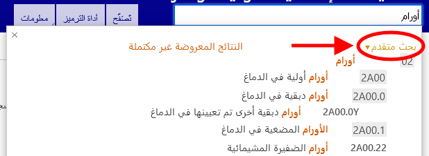
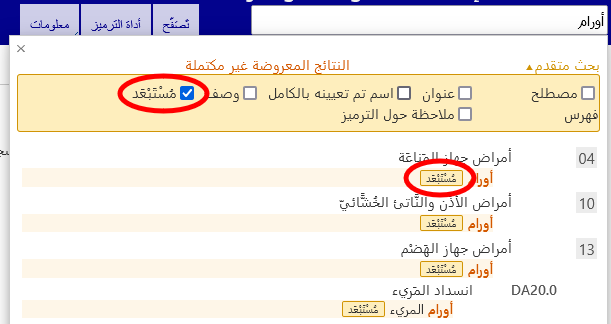

# مساعدة البحث المتقدم

يتيح البحث المتقدم البحث عن خصائص محددة في التصنيف. يمكنك البحث عن جميع الخصائص أو مجموعة فرعية محددة فقط.

يُرجى إدخال كلمات رئيسية في خانة ⁧⁩البحث في النص⁧⁩ وتحديد الخصائص التي تريد تضمينها في البحث.

سيبحث النظام عن الكلمات الرئيسية في الخصائص التي حددتها. 

يتم فرز النتائج حسب جودة تطابق النص المُدخل مع العبارة الموجودة في التصنيف الدولي للأمراض. كما تُجمع النتائج باستخدام التسلسل الهرمي للتصنيف، وإذا تطابق نص البحث مع فئة العنصر الأصلي وعناصر تابعة متعددة، فستظهر النتائج بطريقة تُسهِّل تحديد هذه العلاقة بصريًا. توضح القائمة العناوين فقط أو أفضل حالات التطابق من بين المصطلحات المطابقة، وذلك عندما لا يكون هناك أي تطابق مع العنوان الذي يتم البحث عنه.

إذا كتبت أكثر من كلمة رئيسية واحدة، فسيبحث النظام عن العناصر التي تحتوي على جميع الكلمات الرئيسية.