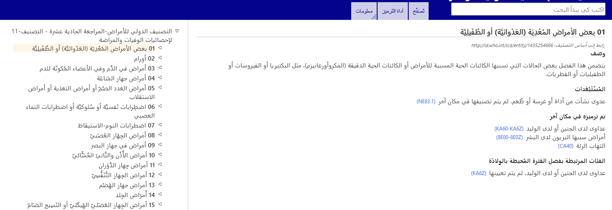
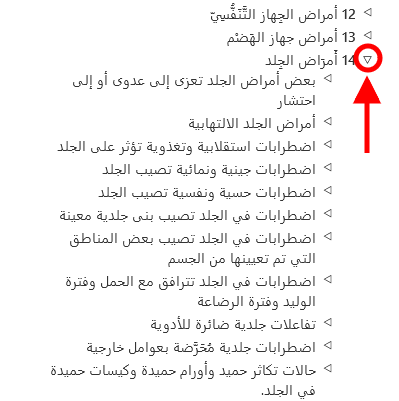

# متصفح التصنيف-11 

متصفح التصنيف-11 هو موقع إلكتروني يتيح للمستخدمين عرض محتويات المراجعة الحادية عشرة للتصنيف.

يوفر دليل المستخدم تفاصيل عن كيفية استخدام الموقع. يمكنك التنقل عبر دليل المستخدم بالضغط على الروابط الموجودة على اليسار، أو العودة إلى تصفح التصنيف-11 باستخدام القوائم. يوجد أدناه العديد من المعلومات المهمة التي ستساعدك في استخدام الموقع على نحو أكثر فاعلية. 

# التصفح باستخدام التسلسل الهرمي

عند تصفح التصنيف-11، ستجد التسلسل الهرمي لموضوعات التصنيف على يسار الشاشة. عند النقر فوق أي عنصر، ستظهر تفاصيل هذا الكيان على يمين الشاشة.

في البداية، يعرض النظام عناصر المستوى الأعلى فقط. ومع ذلك، يمكنك عرض العناصر التابعة بالنقر فوق المثلثات الصغيرة الموجودة على يسار العناصر. 

