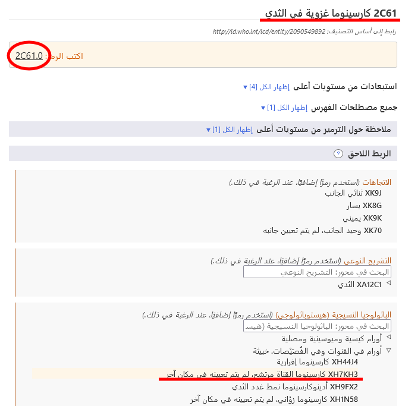

# ⁧⁩الربط اللاحق⁧⁩

يتيح لك نظام الربط اللاحق إضافة المزيد من التفاصيل إلى الكيان المحدد. ويمكن إضافة شتى أنواع المعلومات إلى العناصر المختلفة. على سبيل المثال، يمكن إضافة معلومات 'الباثولوجيا النسيجية' الإضافية إلى معظم فئات الأورام، ولكن لا يمكن إضافتها إلى الفئات الموجودة في أماكن أخرى في التصنيف.

عندما تكون في أحد الكيانات في متصفح التصنيف-11، سيوضح قسم الربط اللاحق المحاور المحتملة فقط التي تنطبق على هذا الكيان.

تحتوي بعض الفئات على معلومات غير كاملة لأغراض متعددة تتعلق بالتصنيف الدولي للأمراض. في مثل هذه الحالة، تشير الملاحظة ⁧⁩(ينبغي أيضًا ترميز)⁧⁩ إلى ضرورة إضافة معلومات إلى هذا المحور. 

## ⁧⁩عرض مجموعات القيم والبحث فيها

يمكن أن تحصل بعض محاور الربط اللاحق على قيم من مجموعة أصغر من القيم المحتملة مثل ⁧⁩الوضعيات الجانبية⁧⁩، بينما يمكن أن تحصل بعض المحاور على قيم من مجموعة أكبر نسبيًا من القيم مثل ⁧⁩الباثولوجيا النسيجية⁧⁩. 

- إذا كانت مجموعة القيم صغيرة، فسيعرض المتصفح جميع القيم المحتملة مع رموزها. 
- إذا كانت مجموعة القيم كبيرة، فيمكنك البحث في مجموعات القيم بالكتابة في مربع البحث. وسيبحث المتصفح في قيم هذا المحور فقط. بالإضافة إلى البحث، يمكنك تصفح هذا التسلسل الهرمي الفرعي باستخدام ◁

في بعض الأحيان، حتى وإن كانت مجموعة القيم الفعلية لأحد المحاور كبيرة، لا تنطبق جميع القيم من هذه المجموعة على أحد الأمراض. في مثل هذه الحالة، يعرض المتصفح الجزء ذي الصلة أو يبحث فيه فقط. إذا كان عدد القيم التي تنطبق أقل من 12 قيمة، فسيُدرج المتصفح جميع هذه القيم. إذا كانت النتيجة أكبر من ذلك، فسيتيح المتصفح البحث في المحور وتصفحه. 

على سبيل المثال، يمكن الربط اللاحق للمصطلح ⁧⁩كيسَة عَظمِيَّة أمدَمِّيَّة/كيس أُمِّ الدَّم في عَظم⁧⁩ مع ⁧⁩تفصيلة تشريحية نوعية⁧⁩، ولكن لا تنطبق جميع القيم. في مثل هذه الحالة، يعرض المتصفح القيم ذات الصلة أو يبحث فيها فقط. في المثال أدناه، عندما يبحث المستخدم عن كلمة "رأس"، يعرض النظام النتائج الموجودة فقط في فرع 'العظام' المتفرع من محور 'تفصيلة تشريحية نوعية'.

## ⁧⁩إنشاء سلسلة رمز⁧⁩

لإنشاء رمز، يجب النقر فوق القيم المعروضة في نتائج البحث، في قوائم التسلسل الهرمي أو القوائم الأقصر. يوضح المثال أدناه "ورم خبيث في الثَديّ" بالتفصيل مع الوضعيات الجانبية والتشريح النوعي. ويُعرض الرمز الناتج أعلى يسار قسم الربط اللاحق. 

## الربط اللاحق باستخدام قيم متعددة من نفس المحور

يتيح النظام قيمة واحدة لكل محور بالنسبة لمعظم محاور الربط اللاحق. على سبيل المثال، عند الربط اللاحق مع "شديد"، لا يمكنك اختيار القيمة "خفيف" و"معتدل" في الوقت نفسه. ومع ذلك، يتيح النظام توفير قيم متعددة مع بعض المحاور. موضح أدناه المحاور التي تتيح قيمًا متعددة:

- مترافق مع
- حالة سببية
- له مظاهر
- التشريح النوعي
- عوامل عدوى
- عوامل كيميائية
- أدوية

بالنسبة لهذه المحاور، يمكنك توفير أكثر من قيمة واحدة. على سبيل المثال، عندما يكون الربط اللاحق مع التشريح النوعي متاحًا يمكنك تحديد أكثر من موضع في الجسم.

وبالنسبة لبعض محاور الأسباب الخارجية، نتيح قيمًا متعددة فقط عندما تأتي من كتل مختلفة.

على سبيل المثال، عند الربط اللاحق لمصطلح ⁧⁩حادث مروري غير قصدي بإصابة راكب درّاجة هوائية بدواستين⁧⁩ باستخدام محور ⁧⁩واصف لحادث نقل⁧⁩، يمكننا استخدام قيمة واحدة من الكتلة "دور مستخدم المركبة في الشخص المصاب بحادث مواصلات" وقيمة واحدة من الكتلة "الطرف المقابل في حادث تصادم وسائط النقل البرية"، ولكن لا يمكننا استخدام قيمتين من نفس الكتلة.

عندما لا يُسمح بقيم متعددة في أحد المحاور، ويقوم المستخدم بالنقر فوق المحور الثاني، يُغيّر النظام القيمة الموجودة. على سبيل المثال، عند الربط اللاحق مع كلمة "شديد" وأنت قد اخترت بالفعل كلمة ⁧⁩خفيف⁧⁩ بمثابة قيمة، فإن النقر فوق كلمة ⁧⁩معتدل⁧⁩ سيؤدي إلى استعاضة القيمة "خفيف" بالقيمة "معتدل". 

## تطابق الربط اللاحق / الربط المسبق

في بعض الحالات، قد تكون التوليفة التي يقوم المستخدم بإنشائها مطابقة لكيان موجود في التصنيف. في هذه الحالة، يستخدم النظام مفهوم الربط المسبق تلقائيًا عند إنشاء رمز. في المثال أدناه، اختار المستخدم ⁧⁩كارسينوما غزوية في الثدي⁧⁩ وقام بربطها لاحقًا مع ⁧⁩كارسينوما القناة مرتشح، لم يتم تعيينه في مكان آخر⁧⁩. ومع ذلك، بدلًا من توفير رمزين، يوفر النظام رمزًا واحدًا فقط لأنه توجد فئة في التصنيف لهذه التوليفة، وهي ⁧⁩2C61.0 كارسينوما قنوية غزوية في الثدي⁧⁩ ولذلك يوفرها النظام على أنها الرمز. 

## ⁧⁩الربط اللاحق المتداخل⁧⁩

في حالات محددة، يتيح لك النظام تحديد قيم الربط اللاحق بشكل أكبر (أي الربط اللاحق لقيم الربط اللاحق). 