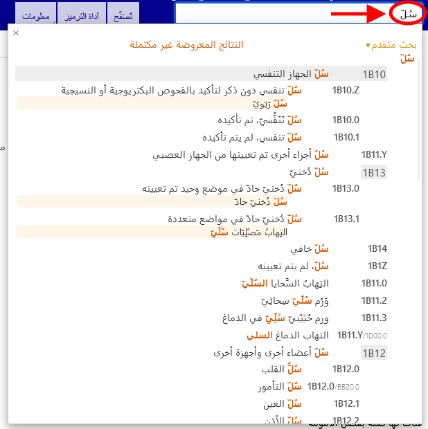

# مساعدة البحث السريع

يساعد البحث السريع في الانتقال سريعًا إلى فئة محددة. تبحث هذه الخاصية في العناوين والمُشْتَمَلات والمرادفات والمصطلحات الأضيق تخصُّصًا، ويبدأ البحث بمجرد البدء في الكتابة ويوفر خيارات في قائمة منسدلة ديناميكية. 

يؤدي النقر فوق أحد الكيانات الموجودة في القائمة إلى عرض هذا الكيان.

يتم فرز النتائج حسب جودة تطابق النص المُدخل مع العبارة الموجودة في التصنيف الدولي للأمراض. كما تُجمع النتائج باستخدام التسلسل الهرمي للتصنيف، وإذا تطابق نص البحث مع فئة العنصر الأصلي وعناصر تابعة متعددة، فستظهر النتائج بطريقة تُسهِّل تحديد هذه العلاقة بصريًا. توضح القائمة العناوين فقط أو أفضل حالات التطابق من بين المصطلحات المطابقة، وذلك عندما لا يكون هناك أي تطابق مع العنوان الذي يتم البحث عنه.