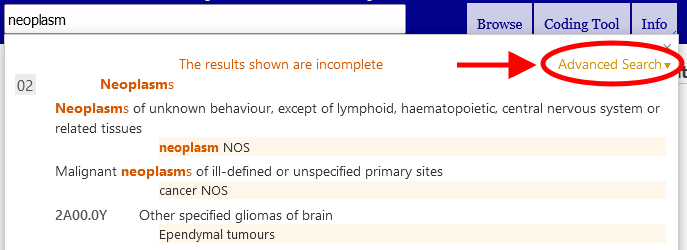

# Advanced search help

Advanced search lets you search selected properties of the classification. You could search all properties or a selected subset only

Please provide keywords in the Search Text field and check the properties that you'd like to include in the search.

The system will search for the keywords in the properties that you've checked

The results are sorted by how good the text entered matches the phrase in ICD. It is also grouped by using the ICD hierarchy so that if the search text matches a parent category and several children, they will appear in a fashion that is easy to identify this relation visually. The list shows only the titles or the best match among the matched terms if the title is not a match.

If you provide more than one keyword, the system will search for items that have all the keywords.