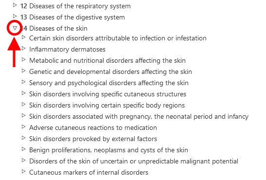

# ICD-11 Browser

ICD-11 Browser is a web site that allows users see the content of the ICD 11th Revision

This User Guide provides details on the usage of the site. You may navigate the user guide by using the links on the left or go back to the ICD-11 Browsing by using the menus. Below are several important information that will help you use the site more efficiently. 

# Browsing using the hierarchy

When browsing ICD-11, you will see the classification hierarchy on the left side of the screen. Clicking on any item will display the details of that entity on the right side of the screen

Initially, the system only shows the top level items. However, you may make the children visible by clicking on the small triangles on the left side of the items. 

