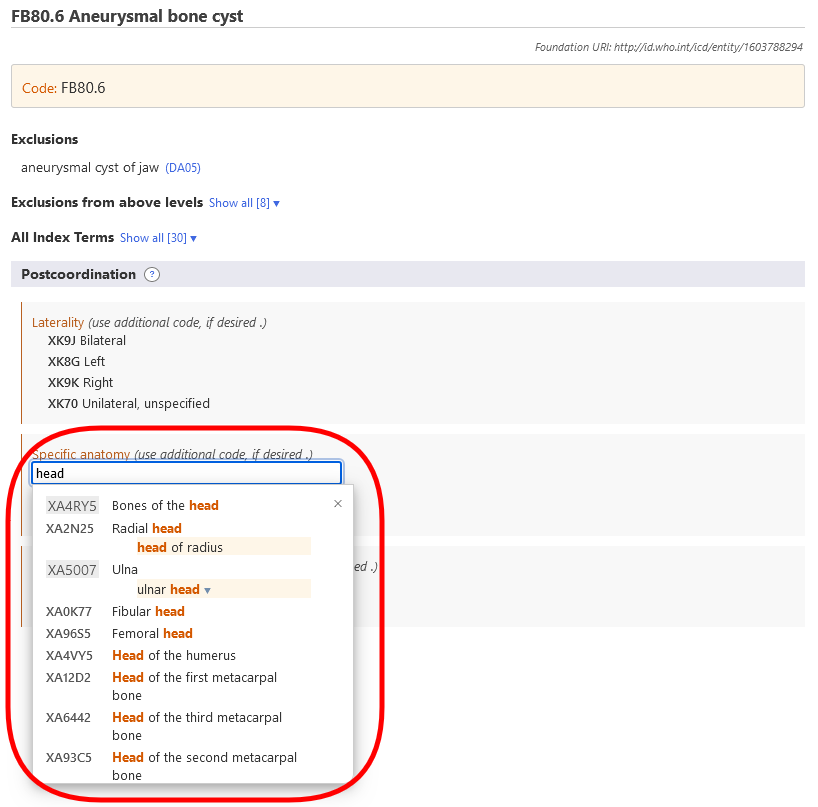
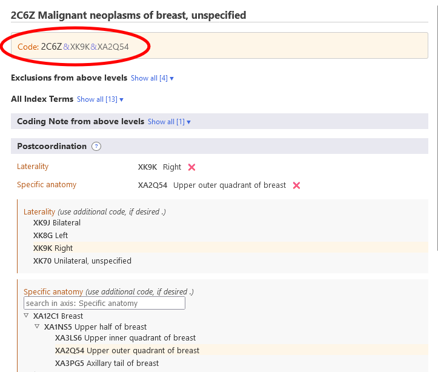
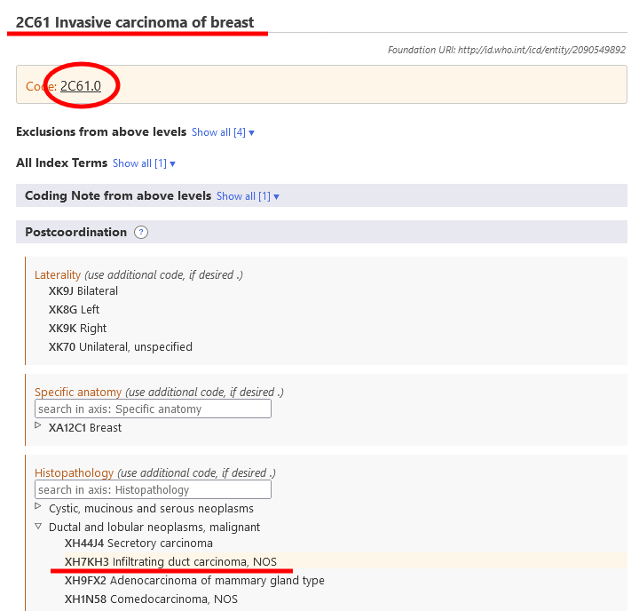

# Postcoordination

The postcoordination system allows adding more detail to the entity that is chosen. Different types of information can be added to different elements. For example, additional 'Histopathology' information could be added to most of the Neoplasm categories but it cannot be added to the categories elsewhere in the classification.

When you are on an entity in the ICD-11 Browser, the postcoordination area will only show the possible postcoordination axes that are applicable to that entity

Some categories contain information that is incomplete for the multiple purposes of ICD. In such cases the note (code also) indicates that information needs to be added for that axis.

## Displaying / Searching value sets

Some of the postcoordination axes can get values from a smaller set of possible values such as Laterality whereas some axes can get values from a rather large value set such as Histopathology.

- If the value set is small, the browser will show all possible values with their codes.
- If the value set is large, you could search the valuesets by typing in the search box. The browser will search only the values for that axis. In addition to searching you could browse this sub-hierarchy using the ▷ icon. 

Sometimes, even though the actual value set for an axis is large, not all values from the value set is applicable for a disease. In such cases, the browser will show/search only the relevant part. If the number of values that can be applied is less than 12, the browser will list all of them. If the result is larger than the browser will allow searching and browsing the axis.     

For example, Aneurysmal bone cyst can be post-coordinated with Specific Anatomic Detail but not all values are applicable. In such cases, the browser will display/search only the relevant ones. In the example below, when the user searches "head", the system only shows the hits that are in the 'bones' branch of the 'Specific anatomic detail' axis. 

## Building a Code String

To build a code you need to click on the values that are displayed in the search results, in the hierarchy or in the shorter lists. The example below shows malignant neoplasm of breast detailed with laterality and specific anatomy. The code generated is shown at the top left area of postcoordination section.

## Postcoordination using multiple values from the same axis

The system allows one value per axis for most of the postcoordination axes. For example, when post-coordinating with "severity" you can't pick the value "mild" and "moderate" at the same time. However, for certain axes, the system allows providing multiple values. The axes that allow multiple values are listed below:

- Associated with
- Causing condition
- Has manifestation
- Specific anatomy
- Infectious agents
- Chemical agents
- Medication

For these axes, you may provide more than one value. For example, when postcoordination with specific anatomy is allowed, you may select more than one site

And for some of the external causes axes, we allow multiple values only when they come from different blocks

For example, when post-coordinating Unintentional land transport traffic event injuring a pedal cyclist using the Transport event descriptor axis, we can use one value from the block "VEHICLE USER ROLE OF PERSON INJURED IN TRANSPORT RELATED EVENT" and another from the block "COUNTERPART IN LAND TRANSPORT CRASH" but we can't use two values from the same block.

When multiple values for an axis is not allowed and the user clicks on the second one, the system will replace the existing value. For example, when you are post-coordinating with severity and have already chosen mild as a value, clicking on moderate will replace the mild value with the moderate value.

## Postcoordination / pre-coordination equivalence

In certain cases the combination built by the user may be equivalent to an existing entity in the classification. In these cases, the system will automatically use the pre-coordinated concept when it's building a code. In the example below, the user has chosen Invasive carcinoma of breast and post-coordinated it with Infiltrating duct carcinoma, NOS. However, instead of giving two codes, the system gives just one code because in the classification there is a category for this combination i.e. 2C61.0 Invasive ductal carcinoma of breast and therefore it is given as the code.

## Nested postcoordination

In certain cases the system may allow further specifiying the postcoordination values. (i.e postcoordinating the postcoordination values) 