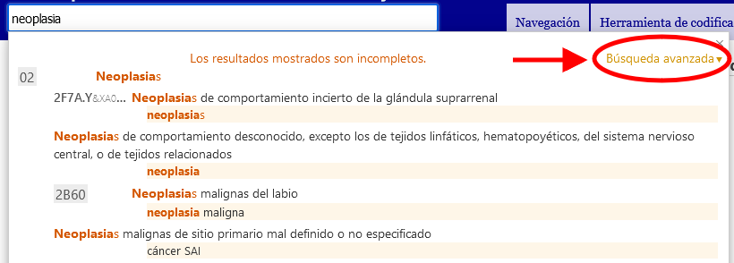
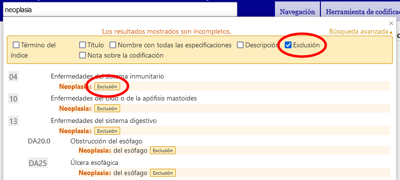

# Búsqueda avanzada: ayuda

La búsqueda avanzada permite hacer búsquedas en todas las propiedades de la clasificación o en un subconjunto específico de propiedades.

Escriba las palabras clave en el campo Texto de búsqueda y marque las propiedades que desee incluir en la búsqueda. El sistema buscará las palabras clave en las propiedades que haya marcado. 

El sistema buscará las palabras clave en las propiedades que haya marcado. 

Los resultados se clasifican por el grado de coincidencia entre el texto buscado y las frases en la CIE. También se agrupan usando la jerarquía de la CIE: si el texto de búsqueda coincide con una categoría padre y varias entidades hijas, aparecerán de manera que resulte fácil visualizar esta relación. En la lista solo se muestran los títulos o, en caso de que las palabras clave no estén en un título, la mejor coincidencia entre los términos encontrados.

Si escribe más de una palabra clave, el sistema buscará los elementos que contengan todas las palabras clave. 