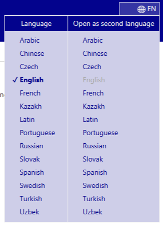
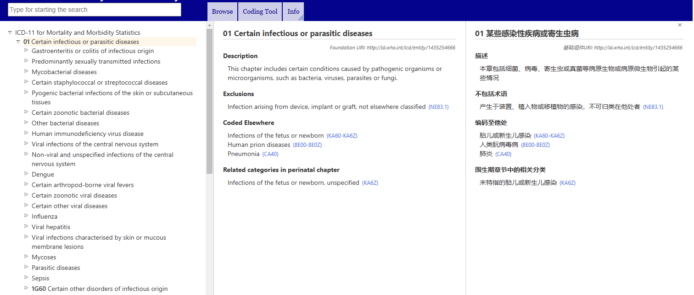

# El navegador de la CIE-11 

El navegador de la CIE-11 es un sitio web que permite a los usuarios ver el contenido de la CIE-11.

En este manual del usuario encontrará detalles sobre el uso del sitio. Puede explorar el manual del usuario haciendo clic en los enlaces que se encuentran en el módulo de la izquierda o regresar al navegador de la CIE-11 usando el menú en la parte superior de la pantalla. A continuación encontrará información importante que lo ayudará a usar el sitio de una manera más eficiente. 

## Explorar usando la jerarquía

Al explorar la CIE-11, verá la jerarquía de clasificación en un campo a la izquierda de la pantalla. Al hacer clic en cualquier elemento se mostrarán los detalles de esa entidad en el lado derecho de la pantalla.

Inicialmente, el sistema solo muestra los elementos del nivel superior. Sin embargo, puede visualizar las entidades hijas haciendo clic en el triángulo pequeño que se encuentra a la izquierda de los elementos.

## Multilingual browsing: using two languages simultaneously

The browser is available in several languages. To select your preferred language, use the menu located at the top corner of the webpage, as shown in the screenshot.

The first column of the language menu sets the browser language. The second column of the language menu allows you to set a secondary language for browsing, enabling simultaneous use of two languages. Refer to the screenshot below, which shows an example of browsing English and Chinese simultaneously.

## How to resize the hierarchy horizontally

Move your mouse cursor over the bottom-right edge of the hierarchy. Once you see the resize cursor, click and hold the left mouse button. Drag the edge of the element left or right to adjust its width. 

Resizing is also available between the two browser contents when using two languages simultaneously.