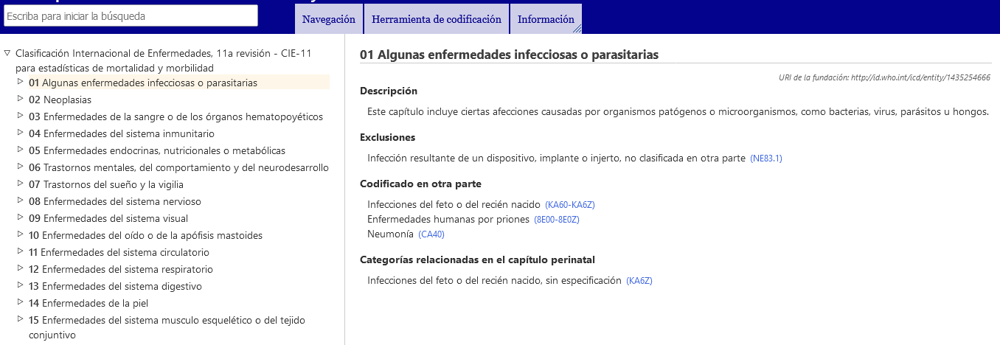
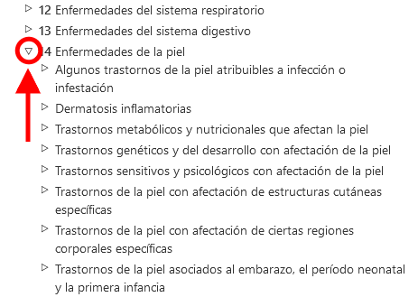

# El navegador de la CIE-11 

El navegador de la CIE-11 es un sitio web que permite a los usuarios ver el contenido de la CIE-11.

En este manual del usuario encontrará detalles sobre el uso del sitio. Puede explorar el manual del usuario haciendo clic en los enlaces que se encuentran en el módulo de la izquierda o regresar al navegador de la CIE-11 usando el menú en la parte superior de la pantalla. A continuación encontrará información importante que lo ayudará a usar el sitio de una manera más eficiente. 

# Explorar usando la jerarquía

Al explorar la CIE-11, verá la jerarquía de clasificación en un campo a la izquierda de la pantalla. Al hacer clic en cualquier elemento se mostrarán los detalles de esa entidad en el lado derecho de la pantalla.

Inicialmente, el sistema solo muestra los elementos del nivel superior. Sin embargo, puede visualizar las entidades hijas haciendo clic en el triángulo pequeño que se encuentra a la izquierda de los elementos.

