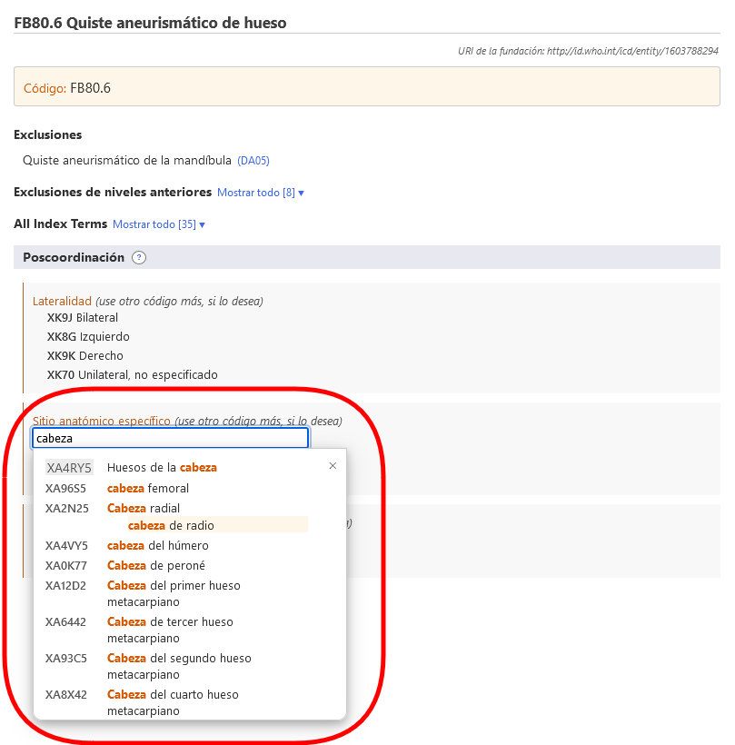
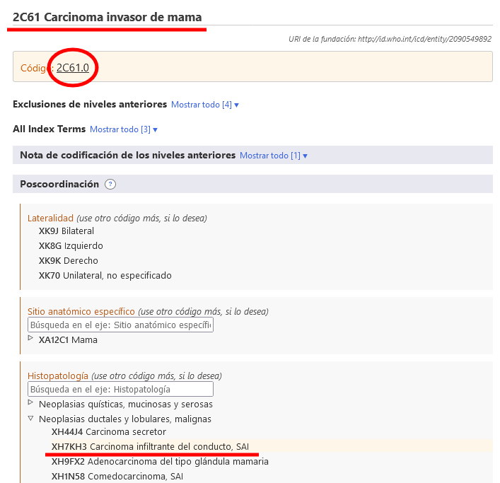

# Poscoordinación

El sistema de poscoordinación permite agregar más detalles a la entidad seleccionada. A los distintos elementos se les puede agregar diferentes tipos de información. Por ejemplo, podría agregarse información adicional sobre “histopatología” a la mayoría de las categorías del capítulo sobre neoplasias, pero no puede agregarse a otras categorías de la clasificación.

Cuando esté en una entidad en el navegador de la CIE-11, el área de poscoordinación solo mostrará los ejes posibles de poscoordinación aplicables a esa entidad.

Algunas categorías contienen información incompleta, considerando las diversas finalidades de la CIE. En tales casos, en la nota (codifique también) se indica la información que debe agregarse en ese eje. 

## Mostrar o buscar grupos de valores 

Usando algunos de los ejes de poscoordinación pueden obtenerse valores de un grupo más pequeño de valores posibles (lateralidad por ejemplo), mientras que en algunos ejes pueden obtenerse valores de un grupo bastante grande (como histopatología). 

- Si el conjunto de valores es pequeño, el navegador mostrará todos los valores posibles con sus códigos.
- Si el conjunto de valores es grande, puede buscar los grupos de valores escribiéndolos en el cuadro de búsqueda. El navegador solo buscará los valores de ese eje. Además de hacer la búsqueda puede explorar esta subjerarquía usando el ícono ▷.

A veces, aunque el conjunto de valores para un eje sea grande, no todos los valores del grupo son aplicables a una enfermedad. En tales casos, el navegador buscará y mostrará solo la parte pertinente. Si el número de valores que pueden aplicarse es menor de 12, el navegador los mostrará todos. Si hay más resultados, el navegador permitirá hacer búsquedas en el eje y navegarlo.      

Por ejemplo, en el caso de quiste aneurismático de hueso puede hacerse la poscoordinación con detalle anatómico específico pero no todos valores son aplicables, por lo que el navegador buscará y mostrará solo los pertinentes. En el ejemplo de abajo, cuando el usuario busca "cabeza", el sistema solo muestra los resultados que se encuentran en la ramificación “huesos” del eje “detalle anatómico específico”.

## Creación de una cadena de códigos

Para crear un código, hay que hacer clic en los valores que se muestran en los resultados de la búsqueda, en la jerarquía o en las listas más cortas. En el ejemplo de abajo se muestra el código de la neoplasia maligna de mama con información sobre lateralidad y detalle anatómico específico. El código generado se muestra en la esquina superior derecha del área de poscoordinación. 

## Poscoordinación usando varios valores del mismo eje

En la mayoría de los ejes de poscoordinación, el sistema permite un valor por eje. Por ejemplo, al hacer la poscoordinación de "gravedad" no se pueden seleccionar los valores "leve" y "moderado" al mismo tiempo. Sin embargo, en ciertos ejes, el sistema permite asignar varios valores. Estos ejes son:

- Asociado con
- Enfermedad o condición causante
- Tiene manifestación clínica
- Detalle anatómico específico
- Agentes infecciosos
- Agentes químicos
- Medicación

En estos ejes, puede suministrar más de un valor. Por ejemplo, cuando se permite hacer la poscoordinación con detalle anatómico específico, puede seleccionar más de una localización; en algunos de los ejes de causas externas, se permiten varios valores solo cuando vienen de diferentes bloques; en algunos de los ejes de causas externas, se permiten varios valores solo cuando vienen de diferentes bloques.

Por ejemplo, al hacer la poscoordinación de Evento no intencional en transporte terrestre en el tránsito que causa traumatismo a ciclista usando el eje Descriptor del evento de transporte, podemos usar un valor del bloque PAPEL COMO USUARIO DEL VEHÍCULO DE LA PERSONA LESIONADA EN UN EVENTO DE TRANSPORTE y otro del bloque CONTRAPARTE EN UNA COLISIÓN DE TRANSPORTE TERRESTRE, pero no podemos usar dos valores del mismo bloque.

Cuando no se permite usar varios valores para un eje y el usuario hace clic en un segundo valor, el sistema reemplazará el valor existente. Por ejemplo, si hace la poscoordinación de gravedad y ya ha seleccionado leve como valor, al hacer clic en moderado se reemplazará el valor leve con el valor moderado. 

## Equivalencia de poscoordinación/precoordinación

En algunos casos, la combinación que crea el usuario puede ser equivalente a una entidad de la clasificación. En estos casos, cuando se cree el código, el sistema usará automáticamente el concepto precoordinado. En el ejemplo de abajo, el usuario ha seleccionado Carcinoma invasor de la mama y ha hecho la poscoordinación con Carcinoma infiltrante del conducto, SAI. Sin embargo, en vez de dar dos códigos, el sistema solo da uno porque en la clasificación hay una categoría para esta combinación (2C61.0 carcinoma invasor de la mama) que, por tanto, se da como código. 

## Poscoordinación anidada

En algunos casos, el sistema puede permitir que se especifiquen más valores de poscoordinación (es decir, poscoordinar los valores de poscoordinación). 