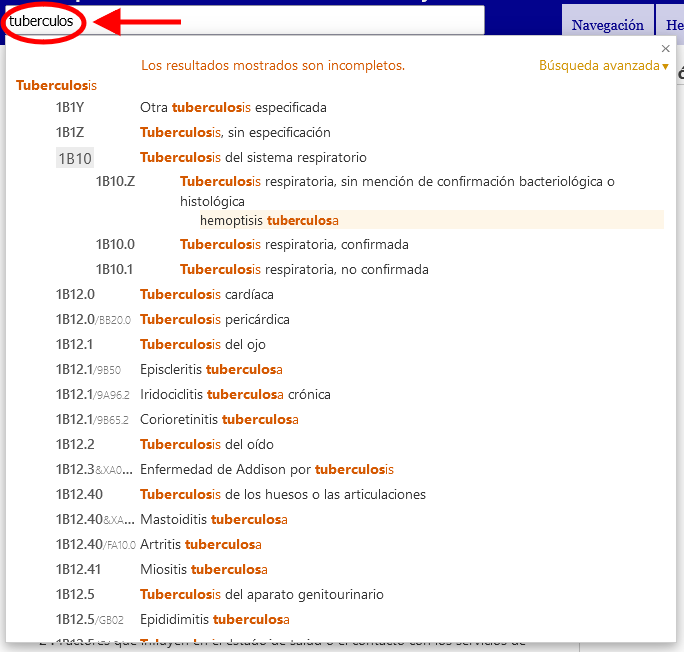

# Búsqueda rápida: ayuda

La búsqueda rápida ayuda al usuario a navegar rápidamente en una categoría particular. Busca en los títulos, las inclusiones, los sinónimos y los términos más específicos; la búsqueda arranca cuando el usuario escribe el término y presenta los resultados en una lista desplegable dinámica. 

Al hacer clic en una de las entidades que aparecen en esta lista se cargará la entidad.

Los resultados se clasifican por el grado de coincidencia entre el texto buscado y las frases en la CIE. También se agrupan usando la jerarquía de la CIE: si el texto de búsqueda coincide con una categoría padre y varias entidades hijas, aparecerán de manera que resulte fácil visualizar esta relación. En la lista solo se muestran los títulos o, en caso de que las palabras clave no estén en un título, la mejor coincidencia entre los términos encontrados.