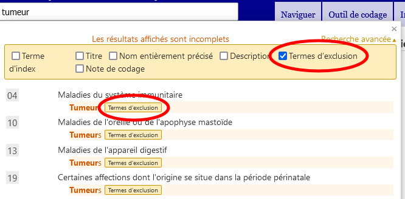

# Aide à la recherche avancée

La recherche avancée vous permet de rechercher des propriétés sélectionnées de la classification. Vous pouvez rechercher dans l’ensemble des propriétés ou seulement au sein d’un sous-ensemble sélectionné.

Veuillez fournir des mots-clés dans le champ Texte de recherche et cocher les propriétés que vous souhaitez inclure dans la recherche.

Le système recherchera les mots-clés dans les propriétés que vous avez sélectionnées. 

Les résultats sont triés en fonction de la correspondance entre le texte saisi et la phrase dans la CIM. Ils sont également regroupés en utilisant la hiérarchie de la CIM, de sorte que si le texte recherché correspond à une catégorie parente et à plusieurs enfants, ils apparaîtront d'une manière qui permet visuellement de facilement identifier cette relation. La liste ne montre que les titres ou la meilleure correspondance parmi les termes correspondants si le titre n'est pas une correspondance.

Si vous fournissez plus d'un mot-clé, le système recherchera les éléments qui contiennent tous les mots-clés.