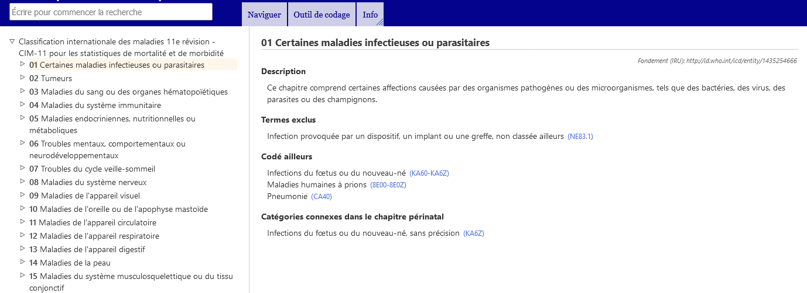
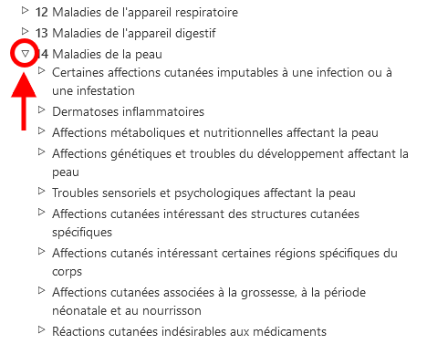

# Navigateur CIM-11 

Le navigateur de la CIM-11 est un site web qui permet aux utilisateurs de visualiser le contenu de la 11e révision de la CIM.

Ce guide de l'utilisateur fournit des détails sur l'utilisation du site. Vous pouvez naviguer dans le guide de l'utilisateur en utilisant les liens sur la gauche ou revenir au navigateur de la CIM-11 en utilisant les menus. Vous trouverez ci-dessous plusieurs informations importantes qui vous aideront à utiliser le site plus efficacement.

# Navigation à l'aide de la hiérarchie

Lorsque vous naviguez dans la CIM-11, vous visualiserez la hiérarchie des classifications sur le côté gauche de l'écran. En cliquant sur un élément, les détails de cette entité s'affichent à droite de l'écran. 

Initialement, le système n'affiche que les éléments du niveau supérieur. Toutefois, vous pouvez rendre les enfants visibles en cliquant sur les petits triangles situés à gauche des éléments.

