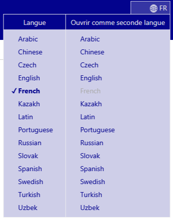

# Navigateur CIM-11 

Le navigateur de la CIM-11 est un site web qui permet aux utilisateurs de visualiser le contenu de la 11e révision de la CIM.

Ce guide de l'utilisateur fournit des détails sur l'utilisation du site. Vous pouvez naviguer dans le guide de l'utilisateur en utilisant les liens sur la gauche ou revenir au navigateur de la CIM-11 en utilisant les menus. Vous trouverez ci-dessous plusieurs informations importantes qui vous aideront à utiliser le site plus efficacement.

## Navigation à l'aide de la hiérarchie

Lorsque vous naviguez dans la CIM-11, vous visualiserez la hiérarchie des classifications sur le côté gauche de l'écran. En cliquant sur un élément, les détails de cette entité s'affichent à droite de l'écran. 

Initialement, le système n'affiche que les éléments du niveau supérieur. Toutefois, vous pouvez rendre les enfants visibles en cliquant sur les petits triangles situés à gauche des éléments.

## Navigation multilingue : utiliser deux langues simultanément

The browser is available in several languages. To select your preferred language, use the menu located at the top corner of the webpage, as shown in the screenshot.

The first column of the language menu sets the browser language. The second column of the language menu allows you to set a secondary language for browsing, enabling simultaneous use of two languages. Refer to the screenshot below, which shows an example of browsing English and Chinese simultaneously.

## How to resize the hierarchy horizontally

Move your mouse cursor over the bottom-right edge of the hierarchy. Once you see the resize cursor, click and hold the left mouse button. Drag the edge of the element left or right to adjust its width. 

Resizing is also available between the two browser contents when using two languages simultaneously.
