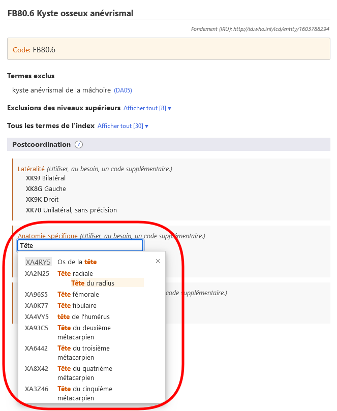
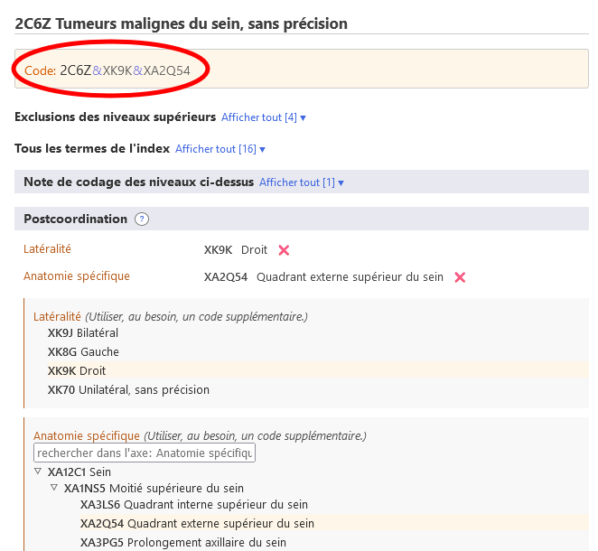

# Postcoordination

Le système de postcoordination permet d'ajouter plus de détails à l'entité choisie. Différents types d'informations peuvent être ajoutés à différents éléments. Par exemple, des informations supplémentaires sur l’ « Histopathologie » peuvent être ajoutées à la plupart des catégories de « Tumeurs », mais elles ne peuvent pas être ajoutées aux autres catégories de la classification.

Lorsque vous vous trouvez sur une entité dans le navigateur de la CIM-11, la zone de postcoordination ne montre que les axes de postcoordination possibles qui sont applicables à cette entité.

Certaines catégories contiennent des informations qui sont incomplètes pour les multiples objectifs de la CIM. Dans ce cas, la note (coder aussi) indique que des informations doivent être ajoutées à cet axe.

## Affichage / Recherche de jeux de valeurs

Certains des axes de postcoordination peuvent obtenir des valeurs à partir d'un ensemble plus restreint de valeurs possibles, comme la Latéralité. tandis que certains axes peuvent obtenir des valeurs à partir d'un ensemble de valeurs assez large, comme l'Histopathologie. 

- Si le jeu de valeurs est petit, le navigateur affichera toutes les valeurs possibles avec leurs codes.
- Si le jeu de valeurs est important, vous pouvez effectuer une recherche dans les jeux de valeurs en tapant dans le champ de recherche. Le navigateur ne recherchera que les valeurs pour cet axe. En plus de la recherche, vous pouvez parcourir cette sous-hiérarchie en utilisant l'icône ▷

Parfois, même si le jeu de valeurs réel d'un axe est important, toutes les valeurs de la série de valeurs ne sont pas applicables à une maladie. Dans ce cas, le navigateur n'affichera/recherchera que la partie pertinente. Si le nombre de valeurs pouvant être appliquées est inférieur à 12, le navigateur les listera toutes. Si le résultat est supérieur à 12, le navigateur permettra de rechercher et de parcourir l'axe.

Par exemple, le Kyste osseux anévrysmal peut être postcoordonné avec Détail anatomique spécifique mais toutes les valeurs ne sont pas applicables. Dans ce cas, le navigateur n'affiche/recherche que les valeurs pertinentes. Dans l'exemple ci-dessous, lorsque l'utilisateur recherche « Tête », le système n'affiche que les résultats qui se trouvent dans la branche « Os » de la section « Détail anatomique spécifique ». 

## Construire une chaîne de codes

Pour construire un code, vous devez cliquer sur les valeurs qui sont affichées dans les résultats de la recherche, dans la hiérarchie ou dans les listes plus courtes. L'exemple ci-dessous montre une tumeur maligne du sein, détaillée avec la latéralité et l'anatomie spécifique. Le code généré est affiché dans la zone supérieure gauche de la section postcoordination. 

## Postcoordination utilisant plusieurs valeurs d'un même axe

Le système autorise une valeur par axe pour la plupart des axes de postcoordination. Par exemple, lors de la postcoordination avec la « gravité », vous ne pouvez pas choisir les valeurs « légère » et « modérée » en même temps. Cependant, pour certains axes, le système permet de fournir plusieurs valeurs. Les axes qui autorisent des valeurs multiples sont les suivants :

- Associé à
- Affection causale
- A pour manifestation
- Anatomie spécifique
- Agents infectieux
- Agents chimiques
- Médicaments

Pour ces axes, vous pouvez fournir plus d'une valeur. Par exemple, lorsque la postcoordination avec une anatomie spécifique est autorisée, vous pouvez sélectionner plus d'un site.

Et pour certains axes de causes externes, nous autorisons plusieurs valeurs uniquement lorsqu'elles proviennent de blocs différents.

Par exemple, lors de la postcoordination d'un Evénement de transport terrestre involontaire blessant un cycliste à pédaleen utilisant l'axe Descriptif de l'événement de transport, nous pouvons utiliser une valeur du bloc « RÔLE DE L'UTILISATEUR DU VÉHICULE D'UNE PERSONNE BLESSÉE LORS D'UN ÉVÉNEMENT DE TRANSPORT » et une autre du bloc « PARTIE PRENANTE DANS UN ACCIDENT DE TRANSPORT TERRESTRE » mais nous ne pouvons pas utiliser deux valeurs du même bloc.

Lorsque plusieurs valeurs pour un axe ne sont pas autorisées et que l'utilisateur clique sur la deuxième, le système remplace la valeur existante. Par exemple, lorsque vous effectuez une postcoordination avec la gravité et que vous avez déjà choisi la valeur léger, le fait de cliquer sur modéré remplacera la valeur léger par la valeur modéré. 

## Equivalence postcoordination / précoordination

Dans certains cas, la combinaison construite par l'utilisateur peut être équivalente à une entité existante dans la classification. Dans ces cas, le système utilisera automatiquement le concept précoordonné lorsqu'il construira un code. Dans l'exemple ci-dessous, l'utilisateur a choisi le Carcinome invasif du sein et l'a postcoordonné avec le Carcinome canalaire infiltrant, SAI. Cependant, au lieu de donner deux codes, le système n'en donne qu'un seul car dans la classification il y a une catégorie pour cette combinaison : le 2C61.0 Carcinome canalaire invasif du sein est donc donné comme le code à utiliser. 

## Postcoordination nichée

Dans certains cas, le système peut permettre de spécifier davantage les valeurs de postcoordination. (c'est-à-dire la postcoordination de valeurs de postcoordination).