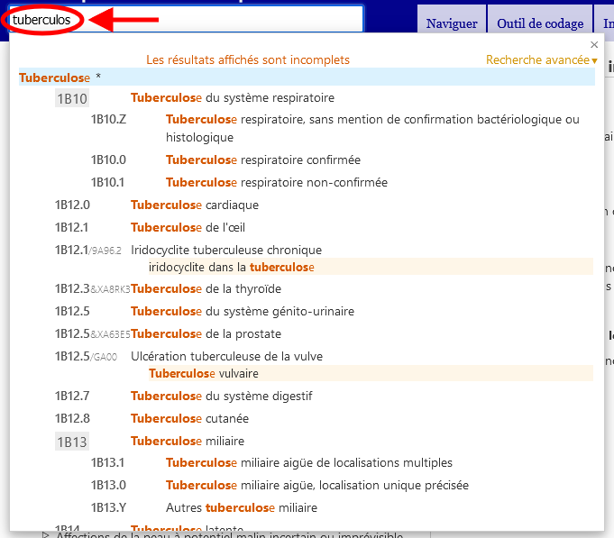

# Aide à la recherche rapide

La recherche rapide vous permet de naviguer rapidement vers une catégorie particulière. Elle recherche les titres, les inclusions, les synonymes et les termes proches. Elle fonctionne en commençant à chercher au fur et à mesure que vous tapez et vous propose des options dans une liste déroulante dynamique. 

En cliquant sur l'une des entités qui apparaissent dans la liste, vous la chargerez.

Les résultats sont triés en fonction de la correspondance entre le texte saisi et la phrase dans la CIM. Ils sont également regroupés en utilisant la hiérarchie de la CIM, de sorte que si le texte recherché correspond à une catégorie parente et à plusieurs enfants, ils apparaîtront d'une manière qui permet d'identifier facilement cette relation visuellement. La liste ne montre que les titres ou la meilleure correspondance parmi les termes correspondants si le titre n'est pas une correspondance.