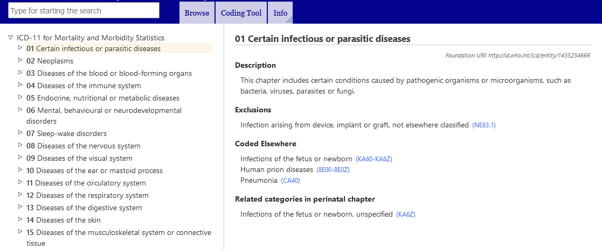
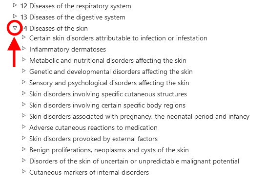
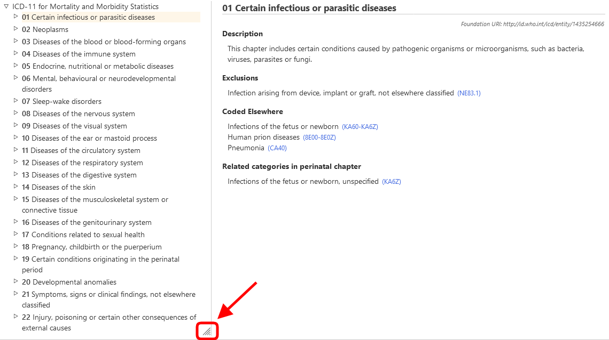

# ICD-11 Browser

ICD-11 Browser is a web site that allows users see the content of the ICD 11th Revision

This User Guide provides details on the usage of the site. You may navigate the user guide by using the links on the left or go back to the ICD-11 Browsing by using the menus. Below are several important information that will help you use the site more efficiently. 

## Browsing using the hierarchy

When browsing ICD-11, you will see the classification hierarchy on the left side of the screen. Clicking on any item will display the details of that entity on the right side of the screen

Initially, the system only shows the top level items. However, you may make the children visible by clicking on the small triangles on the left side of the items. 

## Multilingual browsing: using two languages simultaneously

The browser is available in several languages. To select your preferred language, use the menu located at the top corner of the webpage, as shown in the screenshot.

The first column of the language menu sets the browser language. The second column of the language menu allows you to set a secondary language for browsing, enabling simultaneous use of two languages. Refer to the screenshot below, which shows an example of browsing English and Chinese simultaneously.

## How to resize the hierarchy horizontally

Move your mouse cursor over the bottom-right edge of the hierarchy. Once you see the resize cursor, click and hold the left mouse button. Drag the edge of the element left or right to adjust its width. 

Resizing is also available between the two browser contents when using two languages simultaneously.