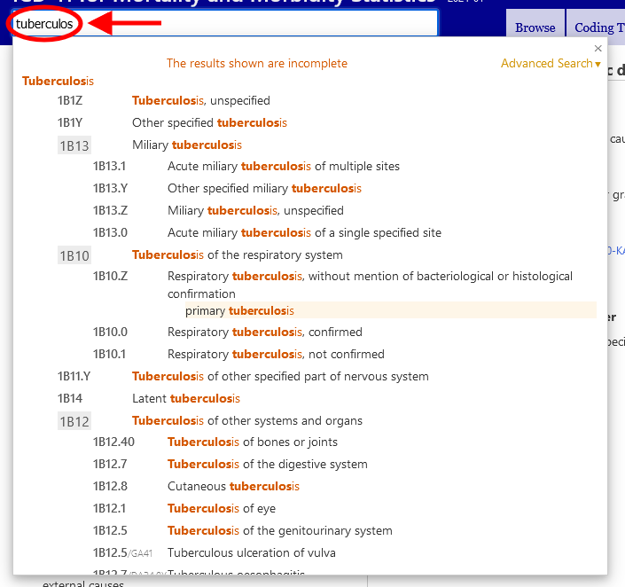

# Quick search help

Quick search helps you quickly navigate to a particular category. It searches the titles, inclusions, synonyms and narrower terms and it works by starting to search as you type and provide you options in a dynamic dropdown list.

Clicking on one of the entities that appear in the list will load the entity.

The results are sorted by how good the text entered matches the phrase in ICD. It is also grouped by using the ICD hierarchy so that if the search text matches a parent category and several children, they will appear in a fashion that is easy to identify this relation visually. The list shows only the titles or the best match among the matched terms if the title is not a match.