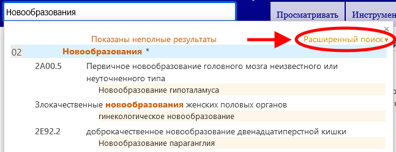
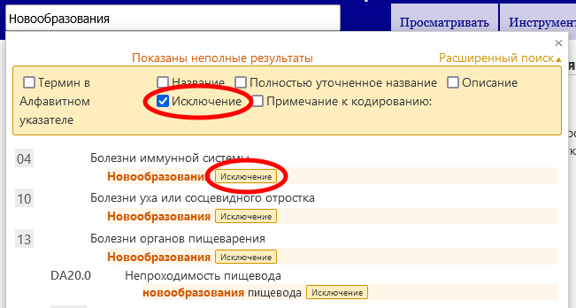

# Справка по расширенному поиску

Расширенный поиск позволяет искать в различных типах записей классификации. Вы можете искать по всем типам записей или только по выбранным.

Пожалуйста, введите ключевые слова в поле «Поиск текста» и отметьте типы записей, которые вы хотите включить в поиск.

Система будет искать ключевые слова в типах записей, которые вы отметили. 

Результаты сортируются по степени соответствия введенного текста фразе в МКБ. Они также группируются с использованием иерархии МКБ так, что, если введенный текст соответствует родительской рубрике и нескольким дочерним, результаты появятся в таком виде, чтобы легко было определить эту связь визуально. В списке отображаются только наименования основных терминов или полное совпадение среди подходящих терминов, если с основным термином нет совпадений.

Если вы указали более одного ключевого слова, система будет искать элементы, содержащие все ключевые слова.