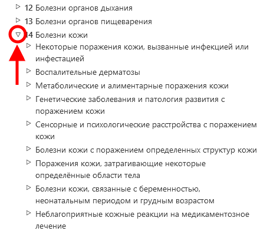

# Браузер МКБ-11

Браузер МКБ-11 - это веб-сайт, который позволяет пользователям просматривать содержание МКБ 11-го пересмотра.

Данное руководство пользователя содержит подробную информацию об использовании сайта. Вы можете перемещаться по руководству пользователя с помощью ссылок слева или вернуться к просмотру МКБ-11 Браузера с помощью меню. Ниже приведена информация, которая поможет вам использовать сайт более эффективно. 

# Просмотр с использованием иерархии

При просмотре МКБ-11 вы увидите иерархию классификации в левой части экрана. Нажав на любой элемент, вы увидите дополнительные сведения о нем в правой части экрана.

Первоначально система показывает только элементы верхнего уровня. Однако вы можете сделать видимыми дочерние записи, нажав на маленькие треугольники в левой части элементов. 

