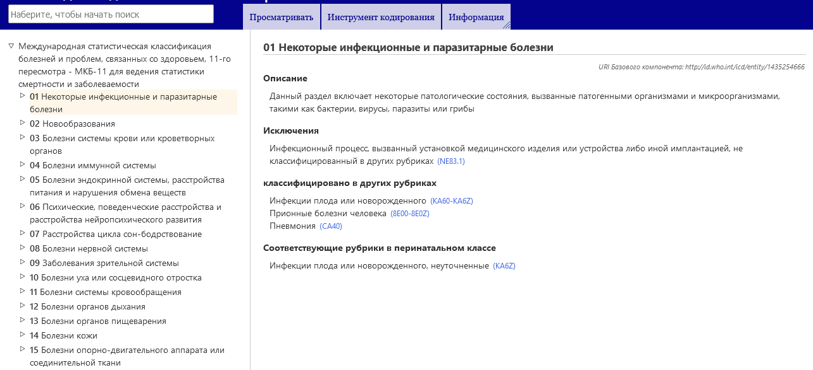
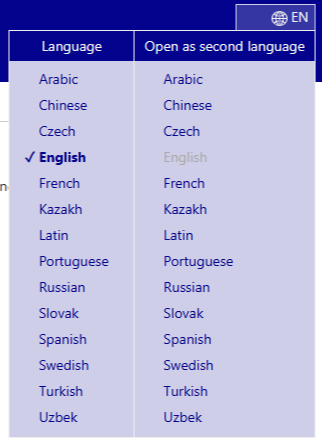
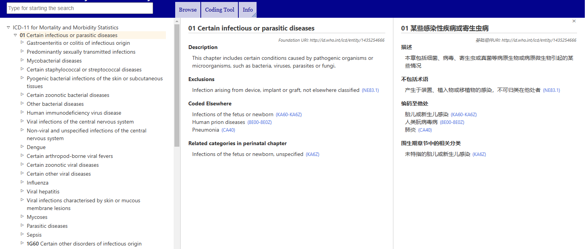

# Браузер МКБ-11

Браузер МКБ-11 - это веб-сайт, который позволяет пользователям просматривать содержание МКБ 11-го пересмотра.

Данное руководство пользователя содержит подробную информацию об использовании сайта. Вы можете перемещаться по руководству пользователя с помощью ссылок слева или вернуться к просмотру МКБ-11 Браузера с помощью меню. Ниже приведена информация, которая поможет вам использовать сайт более эффективно. 

## Просмотр с использованием иерархии

При просмотре МКБ-11 вы увидите иерархию классификации в левой части экрана. Нажав на любой элемент, вы увидите дополнительные сведения о нем в правой части экрана.

Первоначально система показывает только элементы верхнего уровня. Однако вы можете сделать видимыми дочерние записи, нажав на маленькие треугольники в левой части элементов. 

## Multilingual browsing: using two languages simultaneously

The browser is available in several languages. To select your preferred language, use the menu located at the top corner of the webpage, as shown in the screenshot.

The first column of the language menu sets the browser language. The second column of the language menu allows you to set a secondary language for browsing, enabling simultaneous use of two languages. Refer to the screenshot below, which shows an example of browsing English and Chinese simultaneously.

## How to resize the hierarchy horizontally

Move your mouse cursor over the bottom-right edge of the hierarchy. Once you see the resize cursor, click and hold the left mouse button. Drag the edge of the element left or right to adjust its width. 

Resizing is also available between the two browser contents when using two languages simultaneously.