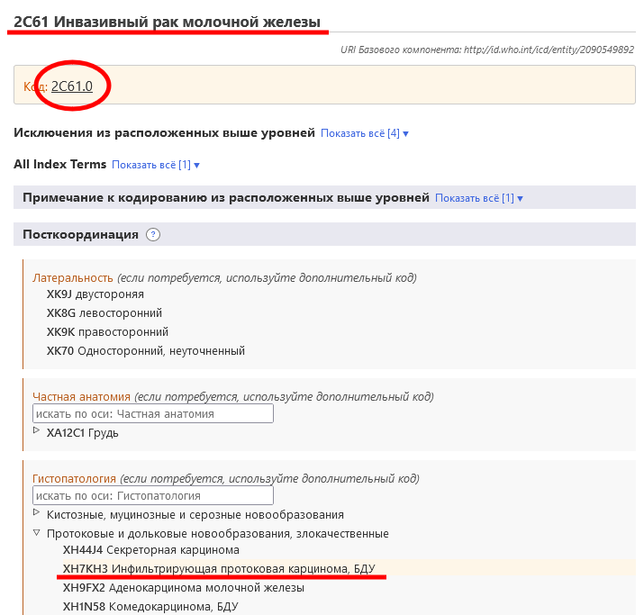

# Посткоординация

Система посткоординации позволяет добавить больше информации к выбранной записи. Различные виды информации могут быть добавлены к различным записям. Например, дополнительная информация "Гистопатология" может быть добавлена к большинству рубрик "Новообразования", но не может быть добавлена к рубрикам в других разделах классификации.

Когда вы находитесь на записи в браузере МКБ-11, в области посткоординации будут показаны только те оси посткоординации, которые применимы к этой записи.

Некоторые рубрики содержат информацию, которая является неполной для многочисленных целей МКБ. В таких случаях примечание (Кодировать также) указывает на необходимость добавления информации по данной оси. 

## Отображение/поиск наборов значений

Некоторые оси посткоординации могут получать значения из небольшого набора возможных значений, например, Латеральность, в то время как другие оси могут получать значения из довольно большого набора значений, например, Гистопатология. 

- Если набор значений небольшой, браузер покажет все возможные значения с их кодами.
- Если набор значений большой, вы можете искать значения, вводя их в поле поиска. В браузере будут найдены только значения для данной оси. В дополнение к поиску можно просмотреть данную субиерархию с помощью значка ▷

Иногда, даже если фактический набор значений для оси велик, не все значения из набора значений применимы для записи. В таких случаях браузер покажет/будет искать только соответствующую часть. Если количество значений, которые могут быть применены, меньше 12, браузер перечислит их все. Если результат содержит больше значений, браузер разрешит поиск и просмотр оси.     

Например, Аневризмальная костная киста может быть посткоординирована по оси Конкретные анатомические характеристики, не все значения которой применимы. В таких случаях браузер отобразит/будет искать только соответствующие значения. В приведенном ниже примере, когда пользователь ищет "голова", система показывает только те результаты, которые находятся в ветви кости оси посткоординации Конкретные анатомические характеристики. 

## Построение кодовой строки

Для построения кода необходимо нажать на значения, которые отображаются в результатах поиска, в иерархии или в более коротких списках. В приведенном ниже примере показано, как закодировать "злокачественное новообразование молочной железы, уточненное по латеральности и конкретной анатомии". Созданный код показан в верхней левой части раздела посткоординации. 

## Посткоординация с использованием нескольких значений из одной оси

Система допускает выбрать только одно значение из оси посткоординации для большинства осей. Например, при посткоординации по оси "Тяжесть" вы не можете одновременно выбрать значения "легкая" и "умеренная". Однако для некоторых осей система позволяет выбрать несколько значений. Ниже перечислены оси, которые допускают выбор нескольких значений:

- Связано с
- Состояние, ставшее причиной
- Имеет проявление
- Конкретная анатомия
- Инфекционные агенты
- Химические агенты
- Лекарственное средство

Для этих осей можно выбрать более одного значения. Например, когда разрешена посткоординация с осью Конкретная анатомия, вы можете выбрать более одной локализации.

Для некоторых осей внешних причин допускается несколько значений, только если они происходят из разных блоков.

Например, при посткоординации Непреднамеренного дорожного происшествия на наземном транспорте с травмой велосипедиста, используя ось Описание транспортного происшествия, мы можем использовать одно значение из блока "РОЛЬ ЛИЦА, НАХОДИВШЕГОСЯ В ТРАНСПОРТНОМ СРЕДСТВЕ И ПОСТРАДАВШЕГО В РЕЗУЛЬТАТЕ ТРАНСПОРТНОГО ПРОИСШЕСТВИЯ" и другое из блока "ЛИЦО ИЛИ СРЕДСТВО ПЕРЕДВИЖЕНИЯ, УЧАСТВОВАВШЕЕ В АВАРИИ НАЗЕМНОГО ТРАНСПОРТНОГО СРЕДСТВА", но мы не можем использовать два значения из одного и того же блока.

Если выбор нескольких значений из одной и той же оси недопустимы, и пользователь нажимает на второе значение, система заменит существующее значение. Например, если вы проводите посткоординацию по степени тяжести и уже выбрали в качестве значения легкая степень, нажатие на умеренная степень заменит значение легкой степени на умеренную. 

## Эквивалентность посткоординации / предкоординация

В некоторых случаях комбинация кодов, построенная пользователем, может быть эквивалентна существующей записи в классификации. В этих случаях система будет автоматически использовать предварительно скоординированную концепцию при построении кода. В приведенном ниже примере пользователь выбрал Инвазивная карцинома молочной железы и посткоординировал ее с Инфильтрирующая протоковая карцинома, БДУ. Однако, вместо того, чтобы вывести два кода, система выдает только один код, потому что в классификации есть рубрика для этой комбинации, т.е. 2C61.0 «Инвазивная протоковая карцинома молочной железы», и поэтому она выводится в качестве кода. 

## Вложенная посткоординация

В некоторых случаях система может предоставить дополнительную детализацию значений посткоординации (т.е. посткоординация значений посткоординации).