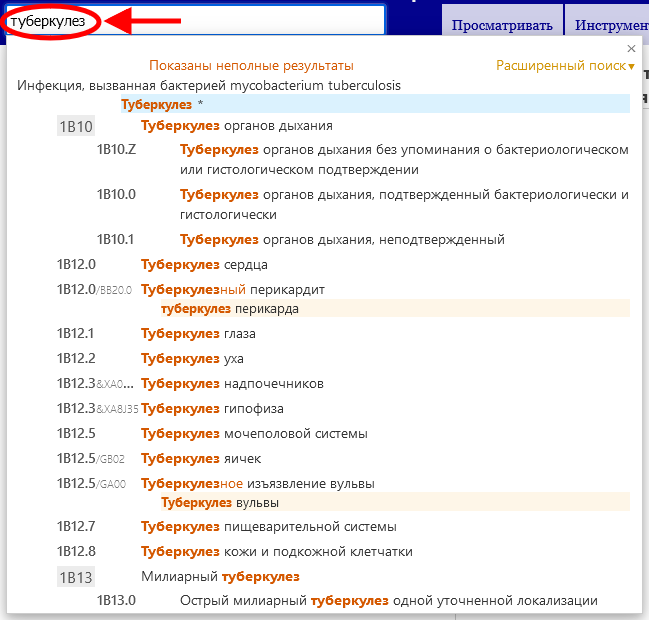

# Справка по быстрому поиску

Быстрый поиск помогает быстро перейти к определенной рубрике. Поиск идет по названиям, включениям, синонимам и уточненным терминам. Поиск начинается по мере ввода текста, предоставляя варианты в динамически выпадающем списке. 

При нажатии на одну из записей, которые появляются в списке, происходит загрузка записи.

Результаты сортируются по степени соответствия введенного текста фразе в МКБ. Они также группируются с использованием иерархии МКБ так, что, если текст поиска соответствует родительской рубрике и нескольким дочерним, результаты появятся в таком виде, чтобы легко было определить эту связь визуально. В списке отображаются только наименование основных терминов или полное совпадение среди подходящих терминов, если с основным термином нет совпадений. 