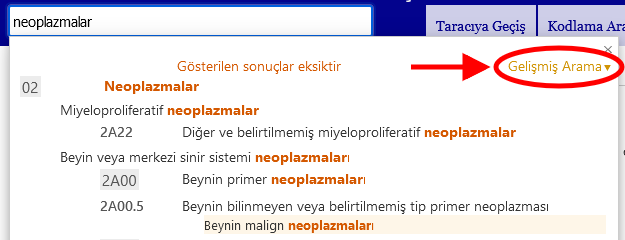
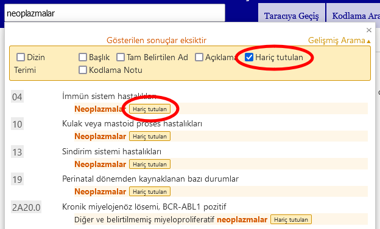

# Gelişmiş Arama Yardım

Gelişmiş arama, sınıflandırmanın seçilen özelliklerini aramanızı sağlar. Tüm seçeneklerde veya yalnızca seçilen bir alt seçenekte arama yapabilirsiniz.

Lütfen Aranacak Metin alanına anahtar kelimeleri giriniz ve aramaya dahil etmek istediğiniz seçenekleri işaretleyiniz.

Sistem seçmiş olduğunuz özellikler dahilinde girdiğiniz anahtar kelimeleri arayacaktır 

Sonuçlar, girilen metnin ICD'deki ifadeyle ne kadar iyi eşleştiğine göre sıralanır. Ayrıca, arama metni bir üst kategori ve birkaç alt kategoriyle eşleşirse, bu ilişkiyi görsel olarak tanımlaması kolay bir şekilde görünecek şekilde, ICD hiyerarşisi kullanılarak gruplandırılmıştır. Liste yalnızca başlıkları gösterir fakat eşleşme bir başlık değilse eşleşen terimler arasındaki en iyi eşleşmeyi gösterir.

Birden fazla anahtar kelime girerseniz, sistem tüm anahtar kelimeleri içeren öğeleri arayacaktır.