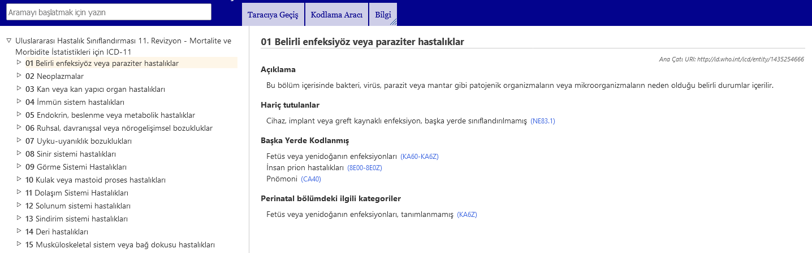
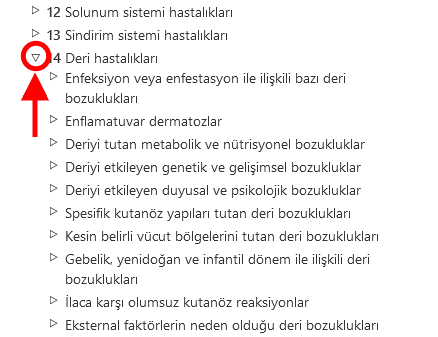

# ICD-11 Tarayıcısı

ICD-11 Tarayıcısı, kullanıcıların ICD 11. Revizyon içeriğini görmelerini sağlayan bir web sitesidir.

Bu Kullanıcı Kılavuzu, sitenin kullanımına ilişkin ayrıntıları sağlar. Soldaki bağlantıları kullanarak kullanım kılavuzunda gezinebilir veya menüleri kullanarak ICD-11 Tarama arayüzüne geri dönebilirsiniz. Aşağıda, siteyi daha verimli kullanmanıza yardımcı olacak birkaç önemli bilgi bulunmaktadır.  

# Browsing using the hierarchy

ICD-11'de tarama yaparken, ekranın sol tarafında sınıflandırma hiyerarşisini göreceksiniz. Herhangi bir öğeye tıklamak, o öğenin ayrıntılarını ekranın sağ tarafında görüntüleyecektir.

Başlangıçta, sistem yalnızca üst kırılımdan öğeleri gösterir. Ancak, öğelerin sol tarafındaki küçük üçgenlere tıklayarak alt kırılımları görünür hale getirebilirsiniz. 

