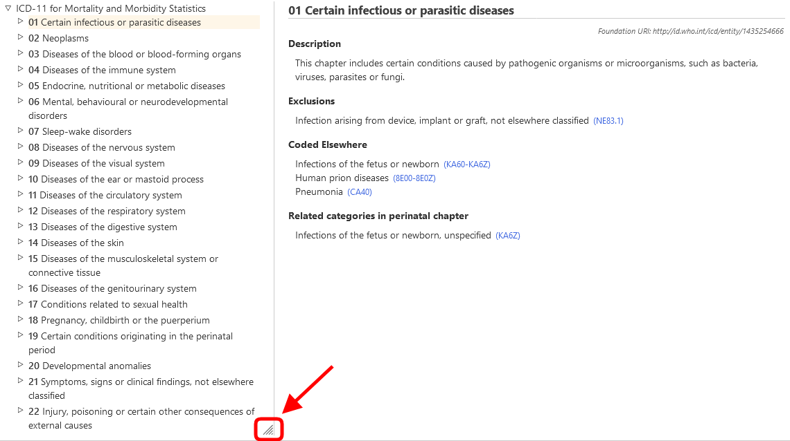

# ICD-11 Tarayıcısı

ICD-11 Tarayıcısı, kullanıcıların ICD 11. Revizyon içeriğini görmelerini sağlayan bir web sitesidir.

Bu Kullanıcı Kılavuzu, sitenin kullanımına ilişkin ayrıntıları sağlar. Soldaki bağlantıları kullanarak kullanım kılavuzunda gezinebilir veya menüleri kullanarak ICD-11 Tarama arayüzüne geri dönebilirsiniz. Aşağıda, siteyi daha verimli kullanmanıza yardımcı olacak birkaç önemli bilgi bulunmaktadır.  

## Browsing using the hierarchy

ICD-11'de tarama yaparken, ekranın sol tarafında sınıflandırma hiyerarşisini göreceksiniz. Herhangi bir öğeye tıklamak, o öğenin ayrıntılarını ekranın sağ tarafında görüntüleyecektir.

Başlangıçta, sistem yalnızca üst kırılımdan öğeleri gösterir. Ancak, öğelerin sol tarafındaki küçük üçgenlere tıklayarak alt kırılımları görünür hale getirebilirsiniz. 

## Multilingual browsing: using two languages simultaneously

The browser is available in several languages. To select your preferred language, use the menu located at the top corner of the webpage, as shown in the screenshot.

The first column of the language menu sets the browser language. The second column of the language menu allows you to set a secondary language for browsing, enabling simultaneous use of two languages. Refer to the screenshot below, which shows an example of browsing English and Chinese simultaneously.

## How to resize the hierarchy horizontally

Move your mouse cursor over the bottom-right edge of the hierarchy. Once you see the resize cursor, click and hold the left mouse button. Drag the edge of the element left or right to adjust its width. 

Resizing is also available between the two browser contents when using two languages simultaneously.