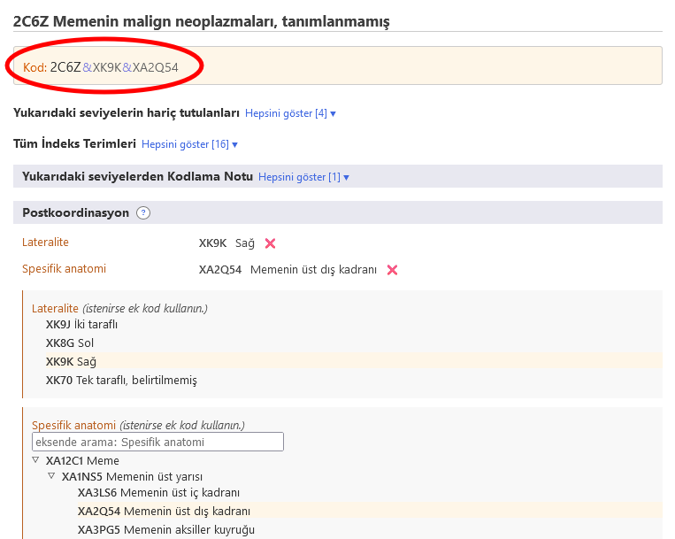

# Postkoordinasyon

Postkoordinasyon sistemi, seçilen öğeye daha fazla ayrıntı eklenmesine izin verir. Farklı öğelere farklı bilgi türleri eklenebilir. Örneğin, Neoplazma kategorilerinin çoğuna ek 'Histopatoloji' bilgisi eklenebilir, ancak sınıflandırmanın başka yerlerindeki kategorilere eklenemez.

ICD-11 Tarayıcısında bir öğe üzerindeyken, postkoordinasyon alanı yalnızca o öğe için geçerli olan olası postkoordinasyon seçeneklerini gösterecektir.

Bazı kategoriler, ICD'nin çeşitli amaçları için eksik olan bilgiler içerir. Bu gibi durumlarda gözlenen uyarı (ayrıca kodlayınız), o eksen için bilgilerin eklenmesi gerektiğini belirtir. 

## Değer kümelerini görüntüleme / arama

Postkoordinasyon seçeneklerinin bazıları Lateralite gibi daha küçük bir olası değerler kümesinden seçenekler alırken, bazı seçenekler Histopatholoji gibi oldukça büyük bir değer kümesinden seçenekler alabilir. 

- Değer kümesi küçükse, tarayıcı olası tüm değerleri kodlarıyla birlikte gösterecektir.
- Değer kümesi büyükse, arama kutusuna yazarak değer kümeleri içerisinde arama yapabilirsiniz. Tarayıcı yalnızca o küme için değerleri arayacaktır. Aramaya ek olarak, ▷ hiyerarşi simgesini kullanarak bu alt hiyerarşiye göz atabilirsiniz. 

SBazen, bir eksen için ayarlanan gerçek değer büyük olsa da, değer kümesindeki tüm değerler bir hastalık için geçerli olmayabilir. Bu gibi durumlarda, tarayıcı yalnızca ilgili kısmı gösterecek/arayacaktır. Uygulanabilecek değer sayısı 12'den az ise, tarayıcı hepsini listeleyecektir. Sonuç 12'den büyükse, tarayıcı eksende arama ve taramaya izin verecektir.     

Örneğin, Anevrizmal kemik kisti Spesifik anatomi ile postkoordine edilebilir fakat tüm anatomi içeriği kullanılabilir değildir. Bu gibi durumlarda, tarayıcı yalnızca ilgili olanları görüntüleyecektir/arayacaktır. Aşağıdaki örnekte, kullanıcı "kafa" araması yaptığında, sistem yalnızca "Spesifik anatomi" ekseninin "kemikler" dalında bulunan isabetli sonuçları gösterir. 

## Kod Dizisi Oluşturma

Bir kod dizisi oluşturmak için arama sonuçlarında, hiyerarşide veya daha kısa listelerde görüntülenen değerlere tıklamanız gerekir. Aşağıdaki örnek, lateralite ve spesifik anatomi ile ayrıntılı olarak memenin malign neoplazmını göstermektedir. Oluşturulan kod, postkoordinasyon bölümünün sol üst alanında gösterilir. 

## Aynı eksenden birden çok değer kullanarak postkoordinasyon

Sistem, postkoordinasyon yaklaşımlarının çoğu için eksen başına bir değere izin verir. Örneğin, "şiddet" altından bir değer ile postkoordinasyon yaparken aynı anda hem "hafif" hem "orta" değerini seçemezsiniz. Ancak, belirli eksenler için sistem birden fazla değer sağlamaya izin verir. Birden çok değere izin veren eksenler aşağıda listelenmiştir:

- İle ilişkili
- Neden olan durum
- Tezahürü
- Spesifik anatomi
- Enfeksiyöz ajanlar
- Kimyasal ajanlar
- İlaç tedavisi

Bu eksenler için birden fazla değer verebilirsiniz. Örneğin, Spesifik anatomi ile postkoordinasyona izin verildiğinde, birden fazla anatomik alan seçebilirsiniz.

Ve bazı dış neden eksenleri için, yalnızca farklı bloklardan geldiklerinde birden fazla değere izin veriyoruz.

Örneğin, Pedallı araç binicisinin yaralandığı kasıtsız kara taşımacılığı trafik olayı 'nı Nakil olayı tanımlayıcısı eksenini kullanarak poskoordine etmek istediğimizde, "ULAŞIMLA İLGİLİ OLAYDA YARALANAN KİŞİNİN ARACI KULLANIYOR OLMASI" bloğundan bir veri ve "KARAYOLU TAŞIMACILIĞI KAZASINDA TARAF OLMA" bloğundan da bir kod kullanabiliriz fakat aynı bloktan iki kod kullanımı mümkün değildir.

Bir eksen için birden fazla değere izin verilmediğinde ve kullanıcı ikincisine tıkladığında, sistem mevcut değeri değiştirecektir. Örneğin, şiddet ile postkoordinasyon yaparken ve zaten bir değer olarak hafif'i seçtiyseniz, orta'ya tıklamak hafif değeri orta değerle değiştirecektir. 

## Postkoordinasyon / prekoordinasyon eşdeğerliliği

IBelirli durumlarda, kullanıcı tarafından oluşturulan kombinasyon, sınıflandırmadaki mevcut bir öğeye eşdeğer olabilir. Bu durumlarda, sistem bir kod oluştururken otomatik olarak prekoordine edilmiş konsepti kullanacaktır. Aşağıdaki örnekte, kullanıcı İnvaziv meme karsinomasını seçmiş ve bunu İnfiltratif duktus karsinomu, BTB ile postkoordine etmiştir. Ancak sistem iki kod vermek yerine sadece bir kod verir çünkü sınıflandırmada bu kombinasyon için bir kategori vardır. Yani 2C61.0 Memenin invaziv duktal karsinomu ve bahsi geçen nedenle bu şekilde tek bir kod verilir. 

## İç içe geçen şekilde postkoordinasyon

Bazı durumlarda sistem, postkoordinasyon değerlerinin daha fazla detaylandırılmasına izin verebilir (yani postkoordinasyon değerlerinin postkoordinasyon değerleri) 