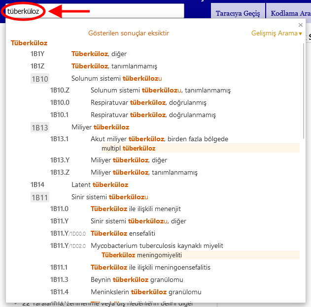

# Hızlı Arama Yardımı

Hızlı arama, belirli bir kategoriye hızla gitmenize yardımcı olur. Başlıkları, dahil edilenleri, eşanlamlıları (sinonimleri) ve dar kapsamlı terimleri arar ve siz yazarken aramaya başlayarak çalışır ve size dinamik bir açılır listede seçenekler sunar. 

Listede görünen öğelerden birine tıklamak o öğeyi yükleyecektir.

Sonuçlar, girilen metnin ICD'deki ifadeyle ne kadar iyi eşleştiğine göre sıralanır. Ayrıca, arama metni bir üst kategori ve birkaç alt kategoriyle eşleşirse, bu ilişkiyi görsel olarak tanımlaması kolay bir şekilde görünecek şekilde, ICD hiyerarşisi kullanılarak gruplandırılır. Liste yalnızca başlıkları veya eşleşen başlık yoksa eşleşen terimler arasındaki en iyi eşleşmeyi gösterir.