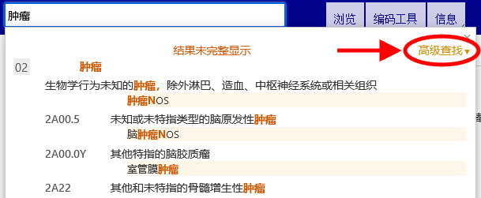
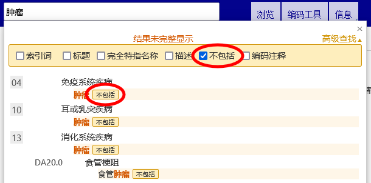

# 高级查找帮助

 高级查找可以在选择的分类属性中进行查找。你可以选择所有属性或仅仅选择某一个分类属性进行查找。

请在查找文本框中键入关键词，然后勾选你希望查找时所包含的属性。

系统会在你所勾选的属性范围内查找关键词。 

检索的结果按照键入文本与ICD词汇匹配度由高到低排列。 同时结果还将以ICD层级结构形式排列，所以当你所查找的文本恰好与一个父节分类和一些子节内容相匹配时，显示的查找结果能够让你更加容易分辨他 们之前的层级关系。结果列表仅显示所有匹配词条的名称。当词条标题不匹配时，仅显示匹配度最佳的词条。

 如果关键词不只一个，系统会检索包含所有关键词的项目。