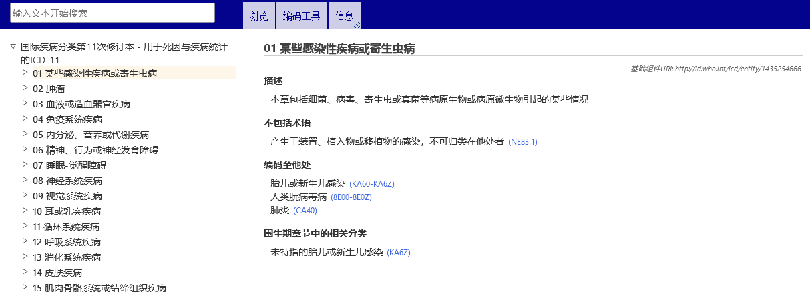
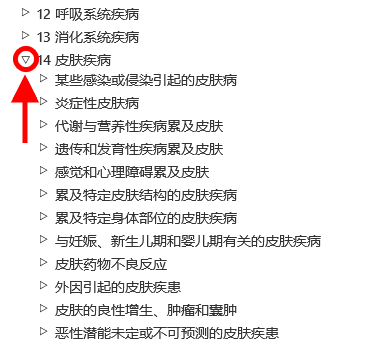

# ICD-11浏览器

ICD-11浏览器是可以允许用户查看ICD第11次修订版内容的网站。

用户指南提供了使用该网站的细节信息。您可以通过使用左侧的链接进行导航式浏览，也可以通过菜单返回ICD-11浏览器。下面是可以帮助用户高效使用该网站的几点重要提示。

# 使用层级结构浏览

在浏览ICD-11时，你会在屏幕左边看到分类的层级结构。点击其中任意一个词条，将会在屏幕右侧显示关于该词条的细节信息。

开始系统仅能显示层级最高的词条，你可以点击词条左边的小三角符号进一步显示所有下位子节词条。

