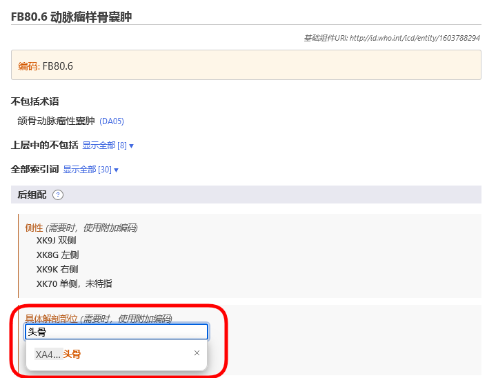
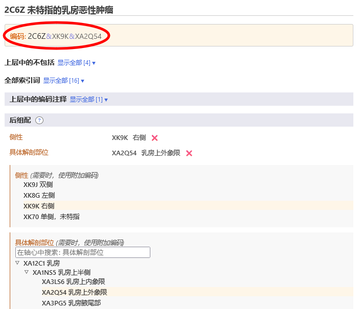

# 后组配

后组配系统允许给选择的实体补充更多细节信息。不同分类可以补充不同类型信息。例如，为大部分的肿瘤分类补充额外的肿瘤形态学信息，但该补充的信息不可用于其他分类。

当你在ICD-11浏览器中选择一个实体时，后组配区域仅能显示可能的适用于该实体的后组配轴心。

一些分类包含的信息不完整，从而不能满足ICD的多用途应用。 在此类案例中， 注释(另编码)提示我们仍需要为该轴心补充信息。 

## 数据集显示和查找

一些后组配轴心能够从较小的数据集中直接获得数值，例如侧别。 而一些轴心可以从很大的数据集获得数值，例如肿瘤形态学。 

- 如果是小数据集，浏览器将显示所有可能的数值及其编码。
- 如果是大数据集，你可以在查找框中键入检索词在数据集中进行查找。浏览器仅会在本轴心内查找数值。 除查找外，你可以使用 ▷ 符号浏览子层级结构。

有时，即使某一轴心的数据集很大，但并不是内部所有数值均适用于某个疾病。在这种情况下，浏览器仅会显示或查找出相关的部分。如果适合的数值个数小于12个，浏览器将列出全部。如果结果数值更多，浏览器允许索引和浏览该轴心。    

例如，动脉瘤性骨囊肿可以使用特殊解剖细节信息进行后组配， 但并不是所有数值都适合选择。在此种情况下，浏览器将显示或查找与之相关部分。在下面例子中，当用户查找“头部”时，系统仅会显示特殊解剖细节轴心中骨骼分支中的命中结果。 

## 构建编码串

构建编码时，你需要点击层级结构、短列表或查找结果中显示的数值。 下面例子显示的是乳腺恶性肿瘤同时给出单侧和具体部位信息的情况。生成的编码将显示在后组配区域的左上方。 

## 使用同一轴心多个数值的后组配

对于大部分后组配轴心，系统仅允许每个轴心选择一个数值。例如，当选择后组配数值“重度”时，此时不可以再同时选择“轻度”和”中度”。但是在某些轴心，系统允许选择多个数值。允许使用多个数值的轴心如下：

- 与.....有关
- 引起的情况
- 临床表现
- 特定解剖结构
- 感染原
- 化学制剂
- 药物制剂

对于这些轴心，你可以提供更多数值。例如：当被允许使用某特定解剖部位作为后组配时，你可以选择多个部位。

对于其他外因轴心，仅当来源于不同类别时我们允许使用多个数值。

例如, 当使用交通事件描述 轴心对 陆地运输交通事故意外伤及骑车人进行后组配时，我们可以从类别“陆地运输碰撞中对方受害者”中选择另一个数值，但我们不允许在相同类别中选择两个数值。

不允许使用同一轴心的多个数值时，用户点击第二个数值，系统会自动替换之前的数值。 例如，当你选择严重程度作为后组配时，如果你已经选择了“轻度”这一数值，此时点击中度数值 则会替换掉“轻度”数值。

## 后组配/预组配等同

在某些案例中，用户构建的编码组合可能与分类中已经存在的实体等同。此时，系统会自动使用预组配编码。 本例中, 用户已经选择了浸润性乳腺癌以及形态学后组配 浸润性导管癌, NOS. 但系统仅会给出一个编码而不是两个编码，因为分类中存在能够涵盖上述信息的 “2C61.0乳腺浸润性导管癌”，因此系统会给出该编码。 

## 嵌套后组配

在某些案例中，系统允许对后组配数值提供更加详细的描述。(例如对后组配数值进行后组配) 