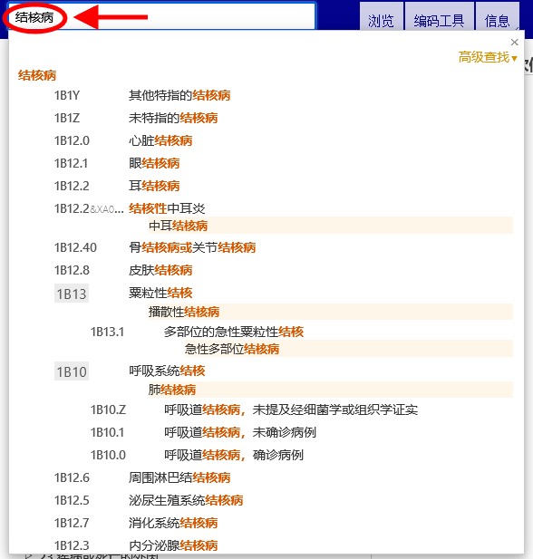

# 快速查找帮助

快速查找功能帮助你快速定位到某一个分类。快速查找在标题、包括、同义词和狭义词中进行查询，在你键入索引词时系统以动态下拉式列表形式显示可供选择的结果。 

点击下拉列表中出现的任何一个实体，系统将加载该实体。

检索的结果按照键入文本与ICD词汇匹配度由高到低排列。同时结果还将以ICD层级结构形式显示，所以当你所查找的文本恰好与一个父节分类和一些子节分类内容相匹配时，显示的结果能够让你更加容易分辨他们之前的层级关系。结果列表仅显示所有匹配词条的名称。当词条标题不匹配时，仅显示匹配度最佳的词条。